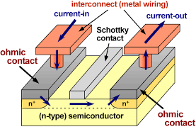

# Semiconductor Device Simulator

## Introduction
This code is designed to numerically solve the <a href="http://www.iue.tuwien.ac.at/phd/triebl/node15.html"> 
Drift-Diffusion-Poisson equations </a> in 2D or 3D for <a href="https://en.wikipedia.org/wiki/Semiconductor_device">
Semiconductor Devices</a>, like the transistor depicted below,

The code runs in parallel using multithreading through the Intel Thread Building Blocks.
Poisson's equation is solved using the 
<a href="https://en.wikipedia.org/wiki/Mixed_finite_element_method"> mixed finite element method</a>. 
The drift-diffusion equations for electron and hole transport are discrititzed with
the <a href="http://www.math.umn.edu/~arnold/papers/dgerr.pdf"> local discontinuous Galerkin method</a>
and time stepping is performed using 
<a href="https://en.wikipedia.org/wiki/Explicit_and_implicit_methods"> implicit-explicit 
(IMEX) methods</a>. 

## Requirements
The requirements for this software is deal.ii library version 8.4.0 or highe and CMake version 2.8 or higher.

## Installation
First obtain and install a copy of the dealii deal.ii library version 8.4.0 or higher. 

## Compiling
To generate a makefile for this code using CMake type into the terminal:

	cmake . -DDEAL_II_DIR=/path_to_deal.ii

To compile the code in release mode use:

	make release

## Running
To run the executable use:

	./main
